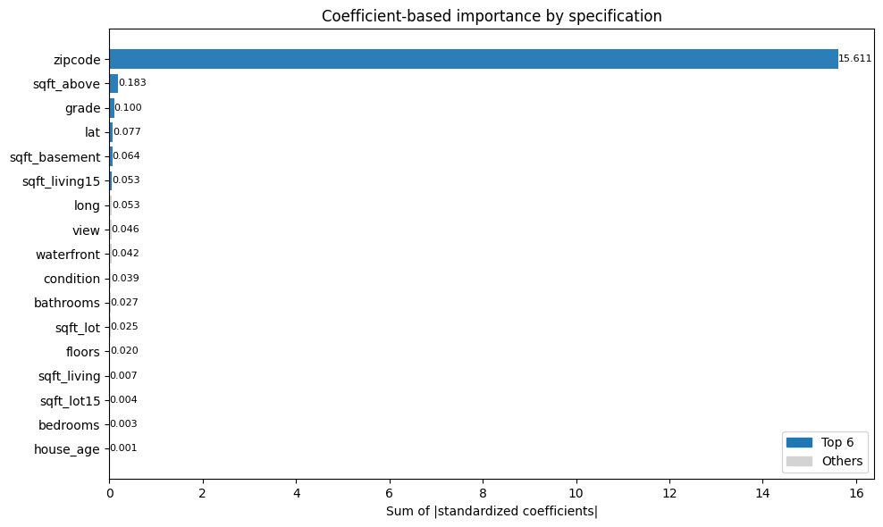

<<<<<<< HEAD
# House Price ML Pipeline (Linear • KNN • XGBoost)

**Author:** Srivatsav Shrikanth
**Goal:** Build a complete ML pipeline to predict home prices demonstrating how a classroom regression task can evolve into a business-ready analytical solution.

---

## Business Context

Real estate investors and analysts rely on accurate price estimation to benchmark listings, detect under or over-pricing, and guide purchase or renovation decisions. This project reframes an academic regression assignment into a **deployable, data driven pricing model** : bridging **business reasoning** with **technical precision**.

---

## Technical Workflow

1. **Data Source** - [Kaggle: King County Housing Data](https://www.kaggle.com/datasets/shivachandel/kc-house-data)
   (~21 000 rows, 21 features)
2. **Feature Engineering** - derive `house_age`, merge build/renovation years, log-transform target
3. **Preprocessing Pipeline** - `ColumnTransformer` + `Pipeline` for imputation, scaling, encoding
4. **Models** :

   * Linear Regression (baseline)
   * K-Nearest Neighbors (distance-weighted, target standardized)
   * XGBoost (ensemble with 500 trees, depth 6)
5. **Evaluation** – R-squared · RMSE · MAE + residual diagnostics + feature importance visuals

---

## Results

| Model                     | R-squared  | RMSE         | MAE         |
| ------------------------- | ---------- | ------------ | ----------- |
| Linear Regression (Top-6) | 0.6408     | $248980     | $90485     |
| KNN Regression (K = 5)    | 0.7653     | $201 266     | $88467     |
| **XGBoost Regression**    | **0.8674** | **$151 278** | **$65343** |

> **+36 % performance gain** over the linear baseline by capturing nonlinear interactions and localized market effects.

---

## Key Visuals

|                                                       |                                                   |
| :---------------------------------------------------: | :-----------------------------------------------: |
|  |  |

*(Figures exported from `MLAssignmentCorrected_files/` in repo as `outputs/`.)*

---

## Insights & Interpretation

* **Zip Code & sqft_above** dominate price variance; strong locational dependence.
* **Heteroscedasticity:** error variance increases with property value and model fits mid-range homes best.
* **Model trade-off:** Linear = interpretability / XGBoost = accuracy / KNN = local flexibility.
* Demonstrates understanding of both *statistical validity* and *business interpretability.*

---

## Tech Stack

Python · pandas · NumPy · scikit-learn · XGBoost · Matplotlib · os · kagglehub
Environment tested on Windows 11 · Python 3.12 (Anaconda)

---

## Project Layout

```
house-price-ml-pipeline/
│
├── notebooks/
│   └── HousePrice_Pipeline.ipynb        ← full ML workflow
│
├── src/                                 ← modular scripts (future split)
│   ├── preprocess.py
│   ├── train_models.py
│   └── evaluate.py
│
├── outputs/                             ← residual & feature plots
├── data/                                ← Kaggle dataset placeholder
├── requirements.txt
├── README.md
└── .gitignore
```

---

## What This Project Demonstrates

✅ End-to-end ML workflow (business → EDA → model → diagnostics)
✅ Reproducible pipelines using scikit-learn best practices
✅ Ability to interpret and communicate technical findings in business language
✅ Mindset of an ML Engineer who bridges **academic analysis and production thinking**

---

## 🤝 About the Author

**Srivatsav Shrikanth**
Graduate Student | Business Insights & Analytics (Humber College) · MSADA (Boston University MET)
=======
# House Price ML Pipeline (Linear • KNN • XGBoost)

**Author:** Srivatsav Shrikanth
**Goal:** Build a complete ML pipeline to predict home prices demonstrating how a classroom regression task can evolve into a business-ready analytical solution.

---

## Business Context

Real estate investors and analysts rely on accurate price estimation to benchmark listings, detect under or over-pricing, and guide purchase or renovation decisions. This project reframes an academic regression assignment into a **deployable, data driven pricing model** : bridging **business reasoning** with **technical precision**.

---

## Technical Workflow

1. **Data Source** - [Kaggle: King County Housing Data](https://www.kaggle.com/datasets/shivachandel/kc-house-data)
   (~21 000 rows, 21 features)
2. **Feature Engineering** - derive `house_age`, merge build/renovation years, log-transform target
3. **Preprocessing Pipeline** - `ColumnTransformer` + `Pipeline` for imputation, scaling, encoding
4. **Models** :

   * Linear Regression (baseline)
   * K-Nearest Neighbors (distance-weighted, target standardized)
   * XGBoost (ensemble with 500 trees, depth 6)
5. **Evaluation** – R-squared · RMSE · MAE + residual diagnostics + feature importance visuals

---

## Results

| Model                     | R-squared  | RMSE         | MAE         |
| ------------------------- | ---------- | ------------ | ----------- |
| Linear Regression (Top-6) | 0.6408     | $248980     | $90485     |
| KNN Regression (K = 5)    | 0.7653     | $201 266     | $88467     |
| **XGBoost Regression**    | **0.8674** | **$151 278** | **$65343** |

> **+36 % performance gain** over the linear baseline by capturing nonlinear interactions and localized market effects.

---

## Key Visuals

|                                                       |                                                   |
| :---------------------------------------------------: | :-----------------------------------------------: |
|  |  |

*(Figures exported from `MLAssignmentCorrected_files/` in repo as `outputs/`.)*

---

## Insights & Interpretation

* **Zip Code & sqft_above** dominate price variance; strong locational dependence.
* **Heteroscedasticity:** error variance increases with property value and model fits mid-range homes best.
* **Model trade-off:** Linear = interpretability / XGBoost = accuracy / KNN = local flexibility.
* Demonstrates understanding of both *statistical validity* and *business interpretability.*

---

## Tech Stack

Python · pandas · NumPy · scikit-learn · XGBoost · Matplotlib · os · kagglehub
Environment tested on Windows 11 · Python 3.12 (Anaconda)

---

## Project Layout

```
house-price-ml-pipeline/
│
├── notebooks/
│   └── HousePrice_Pipeline.ipynb        ← full ML workflow
│
├── src/                                 ← modular scripts (future split)
│   ├── preprocess.py
│   ├── train_models.py
│   └── evaluate.py
│
├── outputs/                             ← residual & feature plots
├── data/                                ← Kaggle dataset placeholder
├── requirements.txt
├── README.md
└── .gitignore
```

---

## What This Project Demonstrates

✅ End-to-end ML workflow (business → EDA → model → diagnostics)
✅ Reproducible pipelines using scikit-learn best practices
✅ Ability to interpret and communicate technical findings in business language
✅ Mindset of an ML Engineer who bridges **academic analysis and production thinking**

---

## 🤝 About the Author

**Srivatsav Shrikanth**
Graduate Student | Business Insights & Analytics (Humber College) · MSADA (Boston University MET)
>>>>>>> 03679f3 (Added structured pipeline, visuals, and professional README)
📍 Toronto, Canada